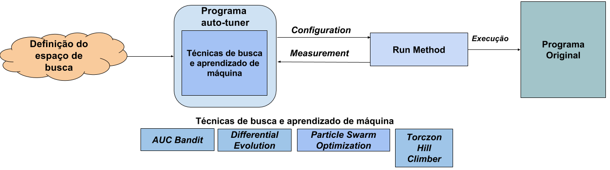

# Ajuste nas dimensões de *Kernels* para Dispositivos Aceleradores (*GPUs*)

**Código 1 - Chamada com *N* blocos de 1 *thread* cada.**
```C
// Chamada a funcao kernel.
funcKernel<<<N, 1>>>(parametros);

```
**Código 2 - Chamada com 1 bloco de *N* *threds* cada.**
```C
// Chamada a funcao kernel.
funcKernel<<<1, N>>>(parametros);
```

**Código 3 - Chamada com *n/1024* blocos de 1024 *threads* cada.**
```C
int blockSize, gridSize;
// Numero de threads em cada bloco de threads.
blockSize = 1024;
// Numero de blocos de threads no grid.
gridSize = (int)ceil((float)n/blockSize);
// Chamada a funcao kernel.
funcKernel<<<gridSize, blockSize>>>(parametros);
```

**Código 4 - Chamada com uma configuração de 6 dimensões *61 x 32* blocos de *32 x 32 threads***
```C
/* Definicao do arranjo de threads em blocos do grid. */
dim3 grid(64, 1, 32);
dim3 block(32, 32, 1);

// Chamada a funcao kernel.
funcKernel<<<grid, block>>> (parametros);
```

**Código 5 - Exemplo de algoritmo que possui laços aninhados**
```C
for (i = 0; i < nx; ++i) {
  for (j = 0; j < ny; ++j) {
    for (k = 0; k < nz; ++k) {
      indice = (i * ny * nz) + (j * nz) + k;
      xy[indice] = sin(x[indice]) + cos(y[indice]); // S_1
    }
  }
}
```

**Tabela 1 - Versões de *Kernels***

| Kernel | Descrição |
|------- | -------- |
| sincos_kernel_3 | Os 3 laços do código original executados: 1 configuração. O *kernel* que faz a execução dos 3 laços aninhados é executado por uma única *thread*.|
|sincos_kernel_2| O *kernel* terá 2 laços do código original para executar. As *nx* iterações do laços mais externo do código original foram transferidas para o arranjo de *threads*.|
|sincos_kernel_1| O *kernel* terá 1 laço do código original a ser executado. As (nx * ny) iterações dos dois laços mais externos foram transferidas para o arranjo de *threads*.|
|sincos_kernel_0| Nenhum dos laços são executados. O *kernel* é formado somente pelo corpo do laço mais interno do aninhamento original. As (nx * ny * nz) iterações dos 3 laços aninhados foram transferidas para o arranjo de *threads*.

**Código 6 - Exemplo de *kernel* do *benchmark* *sincos* com apenas o laço mais interno**
 ```C
__global__ void sincos_kernel_1(DATA_TYPE* x, DATA_TYPE* y, DATA_TYPE* xy, int nx, int ny, int nz, int funcId) {
  int i, k, indice;
  i = getGlobalIdFunc[funcId]();
  for (k = 0; k < nz; k++) {
	indice = (i * nz) + k;
	xy[indice] = sin(x[indice]) + cos(y[indice]);
  }
}
```

**Código 7 - Formato de execução da soma de vetor em CUDA com as configurações geradas**
```
nvprof --metrics achieved_occupancy ./sumvector-cuda <kernel> <gx> <gy> <gz> <bx> <by> <bz> <n> <dimensao> <gpu>
```

**Figura 1 - Exemplo de funcionamento da ferramenta *OpenTuner***

